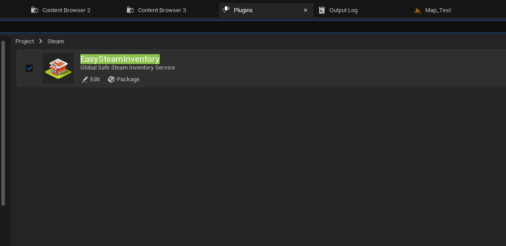
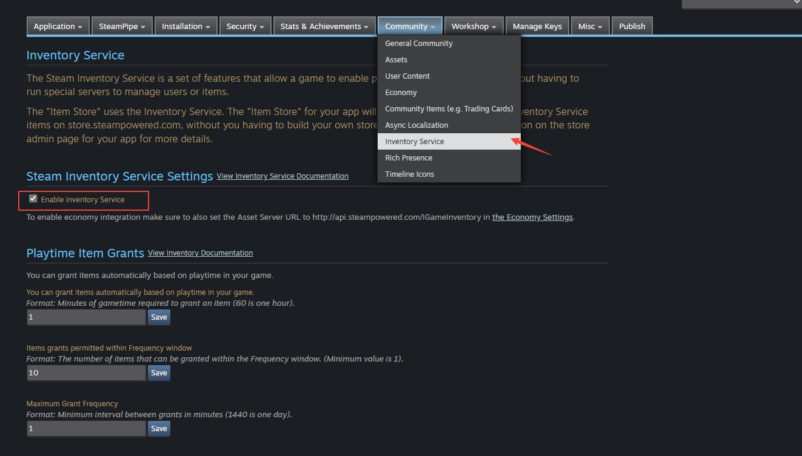
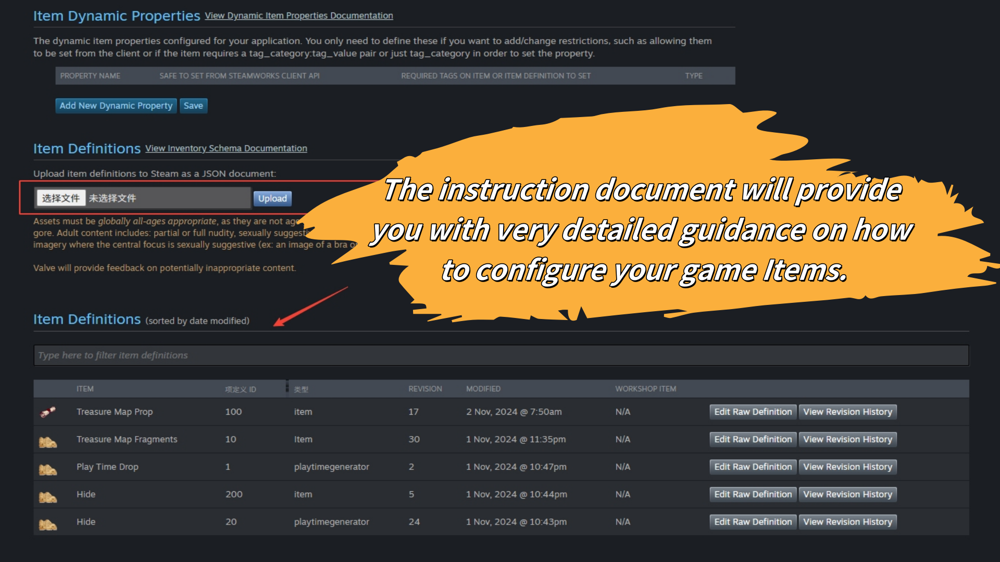
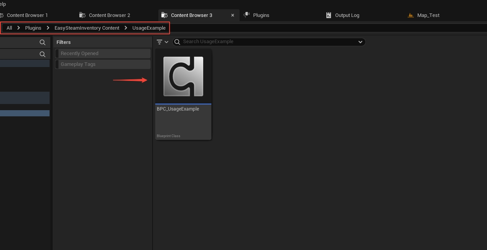
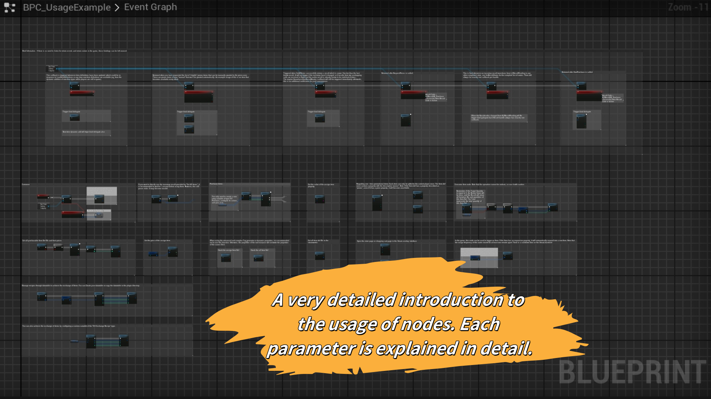
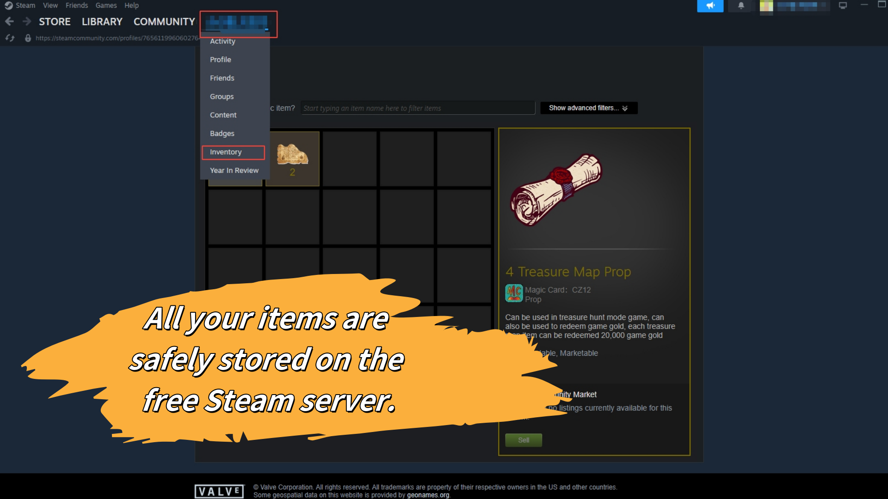
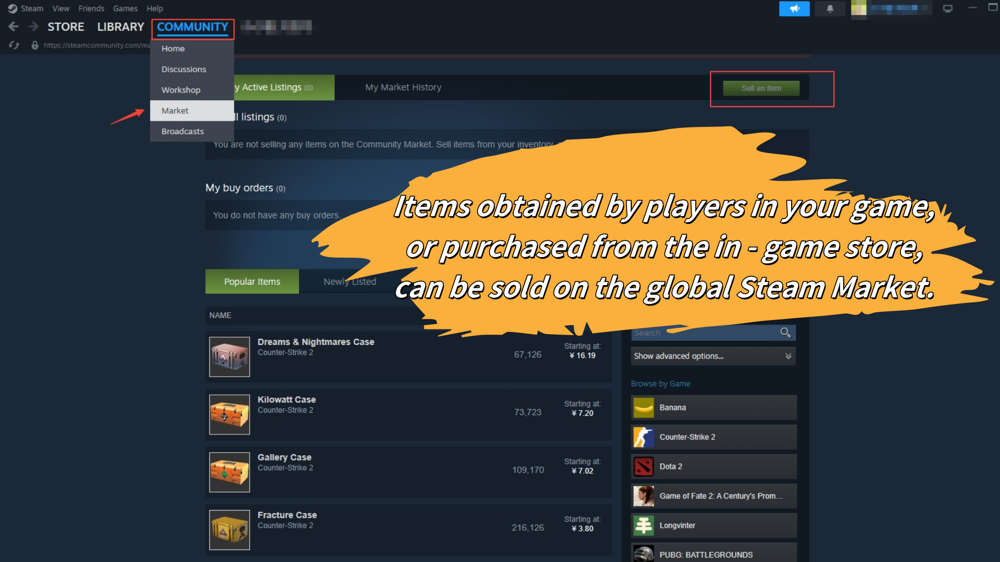
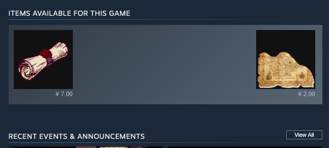
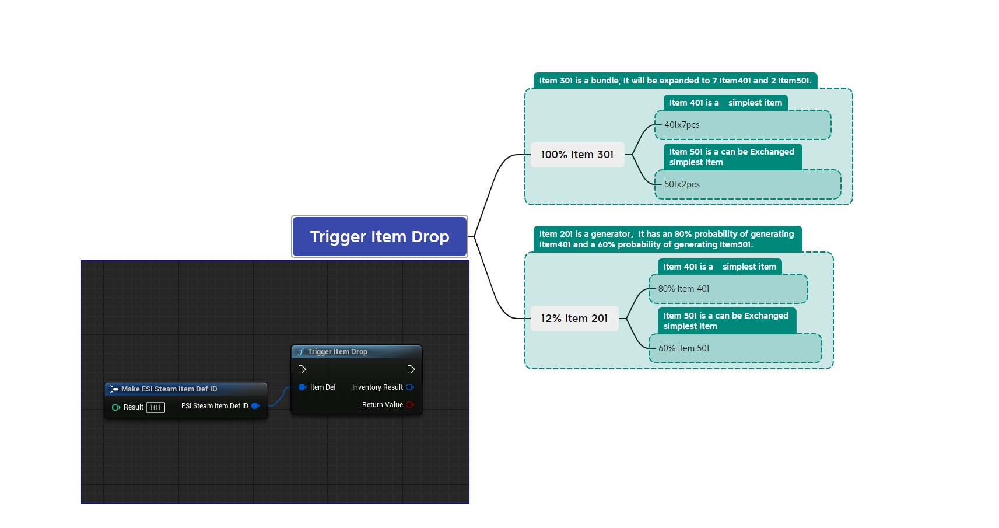

# EasySteamServerInventory
# Easy Steam Server Inventory Plugin

## 0. Preset Config : <a href="https://dev.epicgames.com/documentation/zh-cn/unreal-engine/online-subsystem-steam-interface-in-unreal-engine?application_version=5.5">Steam Important config</a>
    Preset value "Config/DefaultEngine": Please refer to the official UE configuration.

    [Steam Important config](https://dev.epicgames.com/documentation/zh-cn/unreal-engine/online-subsystem-steam-interface-in-unreal-engine?application_version=5.5)

## 1. Installation
    After installing Easy Steam Server Inventory plugin, search for "Easy Steam Inventory" in the UE plugin manager, enable it, and restart Unreal Engine.

## 2. Configuration
    Enable the Inventory service in Steamworks

## 3. Configuration JSON File
    Upload the configured Json file to the Steamworks backend. Remember to carefully check the Json file. Once uploaded, items cannot be deleted, and item IDs cannot be modified. Modifying an item ID will generate a new item, while the old one still remains. If you make mistakes in the above operations and generate unwanted items, you can only add the "hide" property to the item's attributes to hide it from players. 

    There are three basic Json Item configuration examples at the bottom of the document.

## 4. Example of Node Usage
    There is a BPC_UsageExample component within the plugin, which demonstrates the usage methods of most functions and is accompanied by detailed instructions.The path of the BPC_UsageExample component is: All\Plugins\EasySteamInventory Content\UsageExample\BPC_UsageExample

## 5. The location and style of Steam Inventory
    Note: This is the style of the inventory backpack in the Steam client software. You need to create the UI for the in - game inventory backpack and store within the game yourself. This plugin is a functional plugin and does not include any UI. 

## 6. Steam Global Trading
    Items dropped by players in the game or purchased from your in - game store can be set to enable players to sell them on the Steam global trading market. This can enhance the liquidity of your game.

## 7. Sellable items are displayed on your game's homepage on Steam.
    You can configure your sellable items to be displayed on your game's homepage.

## 8. Examples of Items Json Configuration Files
*  "itemdefid": "2001" :Ordinary items can be used to exchange for advanced items.
*  "itemdefid": "3001" :Five pieces of Item 2001 can be exchanged for one piece of Item 3001.
*  "itemdefid": "1001" :This is a tool item and it cannot be retrieved by the game nodes. When executing the item - dropping node, the ID of the tool item needs to be passed in.
*  In the following examples, the content after "//" is annotation and can be deleted.

## 9. Examples JSON
    {
	"appid": YorAppID,
	"items": [
	{
		  "appid": "YorAppID",
		  "itemdefid": "2001",
		  "type": "Item",
		  "display_type": "Prop",
		  "name_english": "Treasure Map Fragments",
		  "name_spanish": "Fragmentos del mapa del tesoro",
		  "price": "1;VLV25",
		  "quantity": 0,
		  "description_english": "For every ten treasure map pieces, one treasure map item can be created",
		  "description_spanish": "Por cada diez piezas del mapa del tesoro, se puede crear un elemento del mapa del tesoro",
		  "background_color": "3C352E",
		  "icon_url": "https://xxx/xxx/Nanme_200_200.png",  //The address where your item icon is hosted on any publicly accessible website.
		  "icon_url_large": "https://xxx/xxx/Nanme_1024_1024.png", //The address where your item icon is hosted on any publicly accessible website.
		  "name_color": "7D6D00",
		  "store_tags": "prop",
		  "tradable": false,
		  "marketable": false,
		  "commodity": true,
		  "auto_stack": true,
		  "granted_manually": true,
	},
	{
		  "appid": "YorAppID",
		  "itemdefid": "3001",
		  "type": "item",
		  "display_type": "Prop",
		  "name_english": "Treasure Map Prop",
		  "name_spanish": "Mapa del tesoro",
		  "price": "1;VLV100",
		  "quantity": 0,
		  "description_english": "Can be used in treasure hunt mode game, can also be used to redeem game gold, each treasure map item can be redeemed 20,000 game gold",
		  "description_spanish": "Se puede utilizar en el modo de búsqueda del tesoro juego, también se puede utilizar para canjeoro juego, cada elemento del mapa del tesoro se puede canje20.000 oro juego",
		  "background_color": "3C352E",
		  "icon_url": "https://xxx/xxx/Nanme_200_200.png",  //The address where your item icon is hosted on any publicly accessible website.
		  "icon_url_large": "https://xxx/xxx/Nanme_1024_1024.png", //The address where your item icon is hosted on any publicly accessible website.
		  "name_color": "7D6D00",
		  "exchange": "2001x5",  //2001 is the ID for redeeming this Item, and 5 is the required quantity. You can set multiple redemption recipes. For example:"exchange":"100,101;102x5;103x3,104x3" Or "exchange":"201x1,202x1;flavor:banana,mass:heavy" Or "exchange":"rarity:common*5",
		  "store_tags": "prop",
		  "tradable": true,
		  "marketable": true,
		  "commodity": true,
	},
	{
		  "appid": "YorAppID",
		  "itemdefid": "1001",
		  "type": "playtimegenerator",
		  "item_slot": "generator",
		  "display_type": "Prop",
		  "name_english": "Play Time Drop",
		  "name_spanish": "Reducción del tiempo de juego",
		  "bundle": "2001x100",  //2001 is the Item ID for the dropped item, and 100 represents a 100% probability. You can set multiple items to drop and set their respective probabilities.eg:"bundle": "100x100;101x50;102x25;103x2;110x20;111x20;120x5;121x3",
		  "quantity": 0,
		  "description_english": "Play Time Drop Tool",
		  "description_spanish": "Herramienta de caída del tiempo de juego",
		  "background_color": "3C352E",
		  "icon_url": "https://xxx/xxx/Nanme_200_200.png",  //The address where your item icon is hosted on any publicly accessible website.
		  "icon_url_large": "https://xxx/xxx/Nanme_1024_1024.png", //The address where your item icon is hosted on any publicly accessible website.
		  "name_color": "7D6D00",
		  "tradable": false,
		  "marketable": false,
		  "commodity": false,
	}
	]
}

## 10. Additional paid value - added services
    Configuring complex Item Definitions is a complicated task. I can provide paid services for developers in need to configure complex Item JSON. Developers with such needs can contact me via the email on the Fab homepage.

## 11. The following are slightly more complex examples for developers in need to explore

	{
		"appid": YorAppID,  //A somewhat difficult example.
		"items": [
		{
			"appid": "YorAppID",
			"itemdefid": "101", // 2xx,is “playtimegenerator Type”
			"type": "playtimegenerator", //In-game generator
			"bundle": "301x100;201x12",  //100% chance to obtain Item 301; 12% chance to obtain Item 201
			"item_slot": "playtimegenerator",
			"display_type": "playtime generator Tools",
			"name_english": "English Item Name",
			"name_spanish": "Other languages Item Name", //If you don't need other languages, you can delete this line.
			"quantity": 0, // Allways 0,it means Unlimited.
			"description_english": "English description",
			"description_spanish": "Herramienta de caída del tiempo de juego",
			"background_color": "3C352E",
			"icon_url": "https://xxx/xxx/Nanme_200_200.png",  //The address where your item icon is hosted on any publicly accessible website.
			"icon_url_large": "https://xxx/xxx/Nanme_1024_1024.png", //The address where your item icon is hosted on any publicly accessible website.
			"name_color": "7D6D00",
			"tradable": false,
			"marketable": false,
			"commodity": false,
		},
		{
			"appid": "YorAppID",
			"itemdefid": "201", // 2xx,is “generator Type”
			"type": "generator", //server generator
			"bundle": "401x80;501x60",  //80% chance to obtain Item 401; 60% chance to obtain Item 501
			"item_slot": "generator",
			"display_type": "Generator Tools",
			"name_english": "English Item Name",
			"name_spanish": "Other languages Item Name", //If you don't need other languages, you can delete this line.
			"quantity": 0, // Allways 0,it means Unlimited.
			"description_english": "English description",
			"description_spanish": "Other language description, you can add more than one language, just add a new entry, modify its name suffix", //If you don't need other languages, you can delete this line.
			"background_color": "3C352E",
			"icon_url": "https://xxx/xxx/Nanme_200_200.png",  //The address where your item icon is hosted on any publicly accessible website.
			"icon_url_large": "https://xxx/xxx/Nanme_1024_1024.png", //The address where your item icon is hosted on any publicly accessible website.
			"name_color": "7D6D00",
			"tradable": false,
			"marketable": false,
			"commodity": false,
		},
		{
			"appid": "YorAppID",
			"itemdefid": "301", // 3xx,is “Bundle Type”
			"type": "Bundle",
			"Bundle":"401x7;501x2" //This bundle will automatically expand into: 7 Item 401 and 2 Item 501.
			"display_type": "Bundle Type",
			"name_english": "English Item Name",
			"name_spanish": "Other languages Item Name", //If you don't need other languages, you can delete this line.
			"quantity": 0, // Allways 0,it means Unlimited.
			"description_english": "English description",
			"description_spanish": "Other language description, you can add more than one language, just add a new entry, modify its name suffix", //If you don't need other languages, you can delete this line.
			"background_color": "3C352E",
			"icon_url": "https://xxx/xxx/Nanme_200_200.png",  //The address where your item icon is hosted on any publicly accessible website.
			"icon_url_large": "https://xxx/xxx/Nanme_1024_1024.png", //The address where your item icon is hosted on any publicly accessible website.
			"name_color": "7D6D00",
			"store_tags": "bundle prop",
			"tradable": true,
			"marketable": true,
			"commodity": true,
		},
		{
			"appid": "YorAppID",
			"itemdefid": "401", // 4xx,is "simplest item type"
			"type": "Item",
			"display_type": "Prop Item",
			"name_english": "English Item Name",
			"name_spanish": "Other languages Item Name", //If you don't need other languages, you can delete this line.
			"price": "1;VLV25", // The selling price of an Item can be USD25, which represents 0.25 USD. VLV25 is a preset price, where we handle the various currency values for you.
			"quantity": 0,  // Allways 0,it means Unlimited.
			"description_english": "English description",
			"description_spanish": "Other language description, you can add more than one language, just add a new entry, modify its name suffix", //If you don't need other languages, you can delete this line.
			"background_color": "3C352E",
			"icon_url": "https://xxx/xxx/Nanme_200_200.png",  //The address where your item icon is hosted on any publicly accessible website.
			"icon_url_large": "https://xxx/xxx/Nanme_1024_1024.png", //The address where your item icon is hosted on any publicly accessible website.
			"name_color": "7D6D00",
			"store_tags": "Item prop",
			"tradable": false,
			"marketable": false,
			"commodity": true,
			"auto_stack": true,
			"granted_manually": true,  
		},
		{
			"appid": "YorAppID",
			"itemdefid": "501", // 5xx,is “Bundle Type”
			"type": "Item",
			"display_type": "Prop Item",
			"name_english": "English Item Name",
			"name_spanish": "Other languages Item Name", //If you don't need other languages, you can delete this line.
			"price": "1;VLV100", // The selling price of an Item can be USD100, which represents 1.00 USD. VLV100 is a preset price, where we handle the various currency values for you.
			"quantity": 0, // Allways 0,it means Unlimited.
			"description_english": "English description",
			"description_spanish": "Other language description, you can add more than one language, just add a new entry, modify its name suffix", //If you don't need other languages, you can delete this line.
			"background_color": "3C352E",
			"icon_url": "https://xxx/xxx/Nanme_200_200.png",  //The address where your item icon is hosted on any publicly accessible website.
			"icon_url_large": "https://xxx/xxx/Nanme_1024_1024.png", //The address where your item icon is hosted on any publicly accessible website.
			"name_color": "7D6D00",
			"exchange": "401x5",  //401 is the ID for redeeming this Item, and 5 is the required quantity. You can set multiple redemption recipes. For example:"exchange":"100,101;102x5;103x3,104x3" Or "exchange":"201x1,202x1;flavor:banana,mass:heavy" Or "exchange":"rarity:common*5",
			"store_tags": "Item prop",
			"tradable": true,
			"marketable": true,
			"commodity": true,
		}
		]
	}